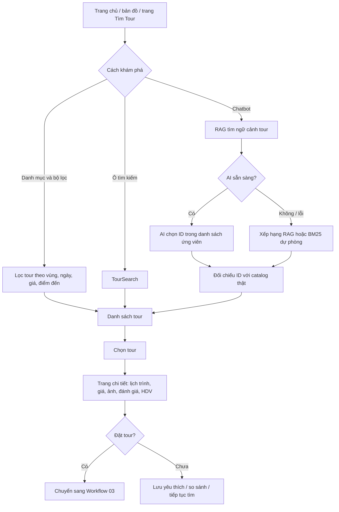

# Workflow 02 — Tìm kiếm và xem tour

```mermaid
flowchart TD
 A[Trang chủ / bản đồ / trang Tìm Tour] --> B{Cách khám phá}
 B -->|Danh mục và bộ lọc| C[Lọc tour theo vùng, ngày, giá, điểm đến]
 B -->|Ô tìm kiếm| D[TourSearch]
 B -->|Chatbot| E[RAG tìm ngữ cảnh tour]
 C --> F[Danh sách tour]
 D --> F
 E --> G{AI sẵn sàng?}
 G -->|Có| H[AI chọn ID trong danh sách ứng viên]
 G -->|Không / lỗi| I[Xếp hạng RAG hoặc BM25 dự phòng]
 H --> J[Đối chiếu ID với catalog thật]
 I --> J
 J --> F
 F --> K[Chọn tour]
 K --> L[Trang chi tiết: lịch trình, giá, ảnh, đánh giá, HDV]
 L --> M{Đặt tour?}
 M -->|Có| N[Chuyển sang Workflow 03]
 M -->|Chưa| O[Lưu yêu thích / so sánh / tiếp tục tìm]
```

Nguồn: catalog tour, `/api/tours`, `/api/tours/{id}`, `/api/locations`; tìm kiếm dùng chung lõi giữa chatbot và trang Tìm Tour.
