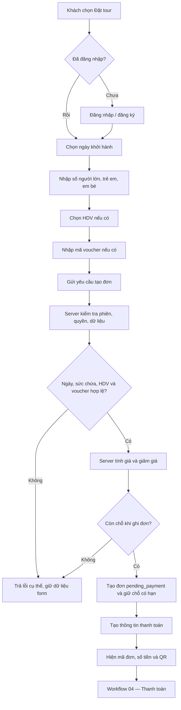

# Workflow 03 — Đặt tour

```mermaid
flowchart TD
 A[Khách chọn Đặt tour] --> B{Đã đăng nhập?}
 B -->|Chưa| C[Đăng nhập / đăng ký]
 B -->|Rồi| D[Chọn ngày khởi hành]
 C --> D
 D --> E[Nhập số người lớn, trẻ em, em bé]
 E --> F[Chọn HDV nếu có]
 F --> G[Nhập mã voucher nếu có]
 G --> H[Gửi yêu cầu tạo đơn]
 H --> I[Server kiểm tra phiên, quyền, dữ liệu]
 I --> J{Ngày, sức chứa, HDV và voucher hợp lệ?}
 J -->|Không| K[Trả lỗi cụ thể, giữ dữ liệu form]
 J -->|Có| L[Server tính giá và giảm giá]
 L --> M{Còn chỗ khi ghi đơn?}
 M -->|Không| K
 M -->|Có| N[Tạo đơn pending_payment và giữ chỗ có hạn]
 N --> O[Tạo thông tin thanh toán]
 O --> P[Hiện mã đơn, số tiền và QR]
 P --> Q[Workflow 04 — Thanh toán]
```

Giá được tính ở server; kiểm tra sức chứa và ghi đơn trong vùng khóa dữ liệu để tránh bán vượt chỗ.
