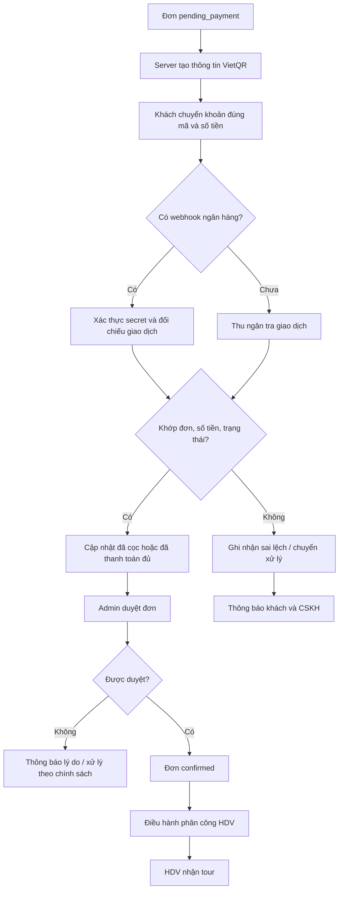

# Workflow 04 — Thanh toán và xác nhận đơn

```mermaid
flowchart TD
 A[Đơn pending_payment] --> B[Server tạo thông tin VietQR]
 B --> C[Khách chuyển khoản đúng mã và số tiền]
 C --> D{Có webhook ngân hàng?}
 D -->|Có| E[Xác thực secret và đối chiếu giao dịch]
 D -->|Chưa| F[Thu ngân tra giao dịch]
 E --> G{Khớp đơn, số tiền, trạng thái?}
 F --> G
 G -->|Không| H[Ghi nhận sai lệch / chuyển xử lý]
 G -->|Có| I[Cập nhật đã cọc hoặc đã thanh toán đủ]
 I --> J[Admin duyệt đơn]
 J --> K{Được duyệt?}
 K -->|Không| L[Thông báo lý do / xử lý theo chính sách]
 K -->|Có| M[Đơn confirmed]
 M --> N[Điều hành phân công HDV]
 N --> O[HDV nhận tour]
 H --> P[Thông báo khách và CSKH]
```

Webhook xác thực riêng; Thu ngân xác nhận giao dịch. Admin duyệt đơn nhưng không xác nhận nhận tiền.
