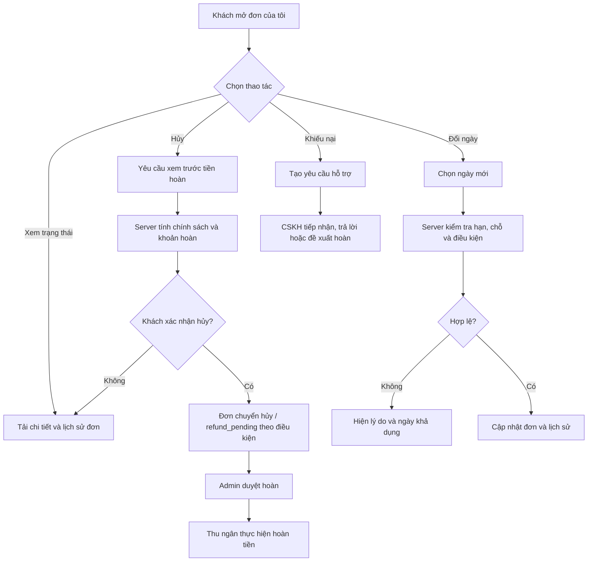

# Workflow 05 — Quản lý đơn, hủy và đổi ngày

```mermaid
flowchart TD
 A[Khách mở đơn của tôi] --> B{Chọn thao tác}
 B -->|Xem trạng thái| C[Tải chi tiết và lịch sử đơn]
 B -->|Hủy| D[Yêu cầu xem trước tiền hoàn]
 D --> E[Server tính chính sách và khoản hoàn]
 E --> F{Khách xác nhận hủy?}
 F -->|Không| C
 F -->|Có| G[Đơn chuyển hủy / refund_pending theo điều kiện]
 G --> H[Admin duyệt hoàn]
 H --> I[Thu ngân thực hiện hoàn tiền]
 B -->|Đổi ngày| J[Chọn ngày mới]
 J --> K[Server kiểm tra hạn, chỗ và điều kiện]
 K --> L{Hợp lệ?}
 L -->|Không| M[Hiện lý do và ngày khả dụng]
 L -->|Có| N[Cập nhật đơn và lịch sử]
 B -->|Khiếu nại| O[Tạo yêu cầu hỗ trợ]
 O --> P[CSKH tiếp nhận, trả lời hoặc đề xuất hoàn]
```

Các hành động cần đăng nhập và được server kiểm tra trạng thái đơn, chủ sở hữu, chính sách và quyền nhân viên.
