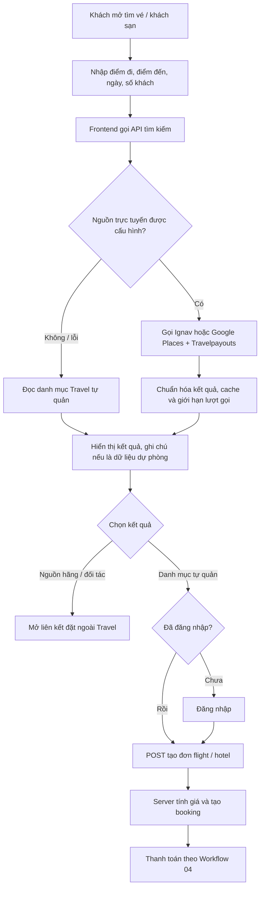

# Workflow 06 — Tìm chuyến bay và khách sạn

```mermaid
flowchart TD
 A[Khách mở tìm vé / khách sạn] --> B[Nhập điểm đi, điểm đến, ngày, số khách]
 B --> C[Frontend gọi API tìm kiếm]
 C --> D{Nguồn trực tuyến được cấu hình?}
 D -->|Có| E[Gọi Ignav hoặc Google Places + Travelpayouts]
 D -->|Không / lỗi| F[Đọc danh mục Travel tự quản]
 E --> G[Chuẩn hóa kết quả, cache và giới hạn lượt gọi]
 F --> H[Hiển thị kết quả, ghi chú nếu là dữ liệu dự phòng]
 G --> H
 H --> I{Chọn kết quả}
 I -->|Nguồn hãng / đối tác| J[Mở liên kết đặt ngoài Travel]
 I -->|Danh mục tự quản| K{Đã đăng nhập?}
 K -->|Chưa| L[Đăng nhập]
 K -->|Rồi| M[POST tạo đơn flight / hotel]
 L --> M
 M --> N[Server tính giá và tạo booking]
 N --> O[Thanh toán theo Workflow 04]
```

Đặt qua link ngoài không thu tiền trong Travel; chỉ đơn thuộc danh mục tự quản dùng luồng booking và thanh toán Travel.
