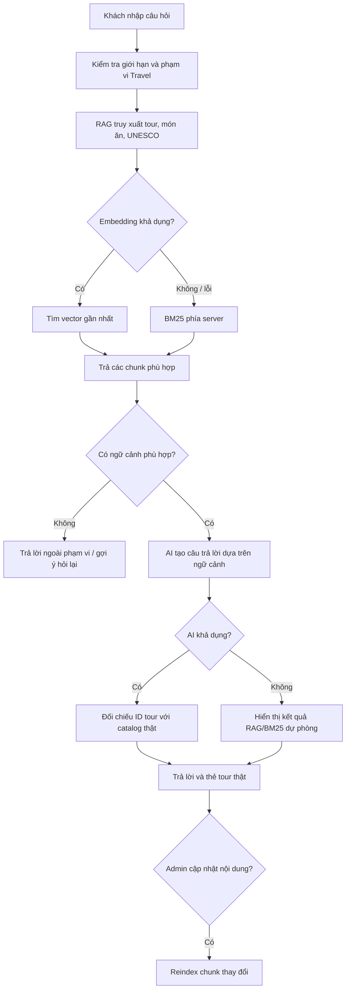

# Workflow 09 — Chatbot và tìm tour AI

```mermaid
flowchart TD
 A[Khách nhập câu hỏi] --> B[Kiểm tra giới hạn và phạm vi Travel]
 B --> C[RAG truy xuất tour, món ăn, UNESCO]
 C --> D{Embedding khả dụng?}
 D -->|Có| E[Tìm vector gần nhất]
 D -->|Không / lỗi| F[BM25 phía server]
 E --> G[Trả các chunk phù hợp]
 F --> G
 G --> H{Có ngữ cảnh phù hợp?}
 H -->|Không| I[Trả lời ngoài phạm vi / gợi ý hỏi lại]
 H -->|Có| J[AI tạo câu trả lời dựa trên ngữ cảnh]
 J --> K{AI khả dụng?}
 K -->|Có| L[Đối chiếu ID tour với catalog thật]
 K -->|Không| M[Hiển thị kết quả RAG/BM25 dự phòng]
 L --> N[Trả lời và thẻ tour thật]
 M --> N
 N --> O{Admin cập nhật nội dung?}
 O -->|Có| P[Reindex chunk thay đổi]
```

Khóa AI ở server; kết quả tour được đối chiếu với catalog để loại ID không tồn tại. API: `/api/rag/*`, `/api/ai/*`.
