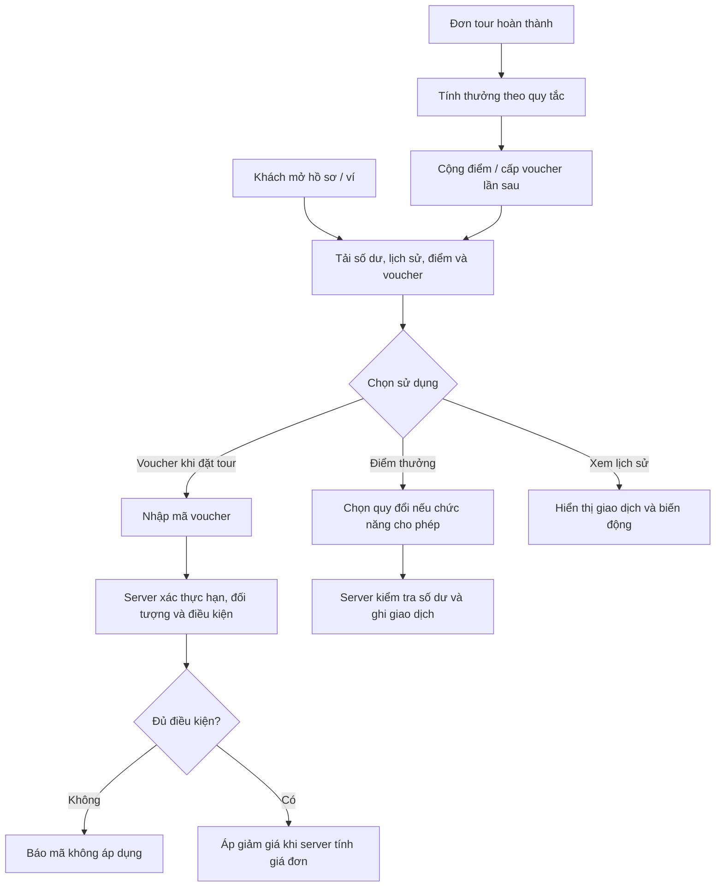

# Workflow 10 — Ví, điểm thưởng và voucher

```mermaid
flowchart TD
 A[Khách mở hồ sơ / ví] --> B[Tải số dư, lịch sử, điểm và voucher]
 B --> C{Chọn sử dụng}
 C -->|Voucher khi đặt tour| D[Nhập mã voucher]
 D --> E[Server xác thực hạn, đối tượng và điều kiện]
 E --> F{Đủ điều kiện?}
 F -->|Không| G[Báo mã không áp dụng]
 F -->|Có| H[Áp giảm giá khi server tính giá đơn]
 C -->|Điểm thưởng| I[Chọn quy đổi nếu chức năng cho phép]
 I --> J[Server kiểm tra số dư và ghi giao dịch]
 C -->|Xem lịch sử| K[Hiển thị giao dịch và biến động]
 L[Đơn tour hoàn thành] --> M[Tính thưởng theo quy tắc]
 M --> N[Cộng điểm / cấp voucher lần sau]
 N --> B
```

Số dư và điều kiện áp dụng được quyết định ở server; voucher chỉ được tính vào đơn nếu hợp lệ.
