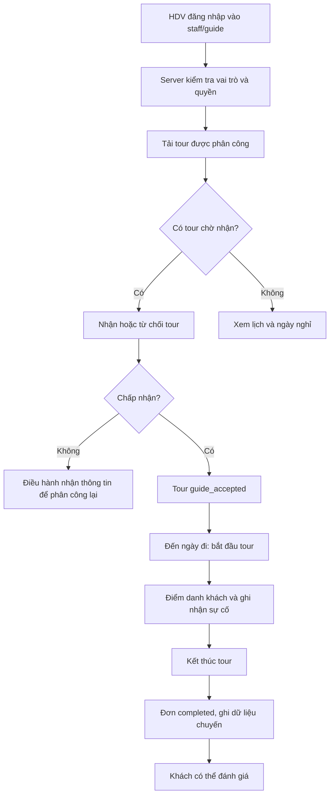

# Workflow 11 — Hướng dẫn viên

```mermaid
flowchart TD
 A[HDV đăng nhập vào staff/guide] --> B[Server kiểm tra vai trò và quyền]
 B --> C[Tải tour được phân công]
 C --> D{Có tour chờ nhận?}
 D -->|Có| E[Nhận hoặc từ chối tour]
 D -->|Không| F[Xem lịch và ngày nghỉ]
 E --> G{Chấp nhận?}
 G -->|Không| H[Điều hành nhận thông tin để phân công lại]
 G -->|Có| I[Tour guide_accepted]
 I --> J[Đến ngày đi: bắt đầu tour]
 J --> K[Điểm danh khách và ghi nhận sự cố]
 K --> L[Kết thúc tour]
 L --> M[Đơn completed, ghi dữ liệu chuyến]
 M --> N[Khách có thể đánh giá]
```

HDV chỉ xem các tour của mình; không xem dữ liệu tiền của khách. Thu nhập/đánh giá hiển thị phụ thuộc phần giao diện có sẵn.
