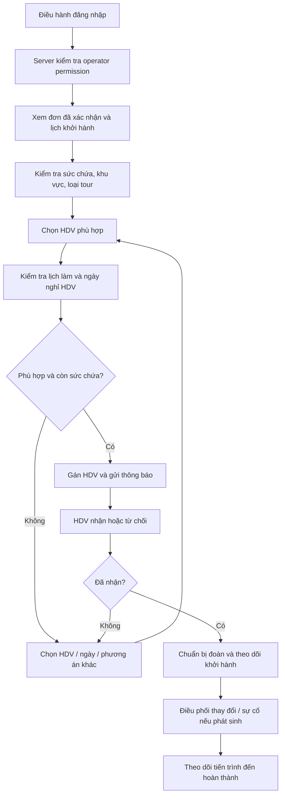

# Workflow 12 — Điều hành tour

```mermaid
flowchart TD
 A[Điều hành đăng nhập] --> B[Server kiểm tra operator permission]
 B --> C[Xem đơn đã xác nhận và lịch khởi hành]
 C --> D[Kiểm tra sức chứa, khu vực, loại tour]
 D --> E[Chọn HDV phù hợp]
 E --> F[Kiểm tra lịch làm và ngày nghỉ HDV]
 F --> G{Phù hợp và còn sức chứa?}
 G -->|Không| H[Chọn HDV / ngày / phương án khác]
 H --> E
 G -->|Có| I[Gán HDV và gửi thông báo]
 I --> J[HDV nhận hoặc từ chối]
 J --> K{Đã nhận?}
 K -->|Không| H
 K -->|Có| L[Chuẩn bị đoàn và theo dõi khởi hành]
 L --> M[Điều phối thay đổi / sự cố nếu phát sinh]
 M --> N[Theo dõi tiến trình đến hoàn thành]
```

Điều hành thao tác phân công và vận hành tour; quyền không bao gồm xem tiền.
