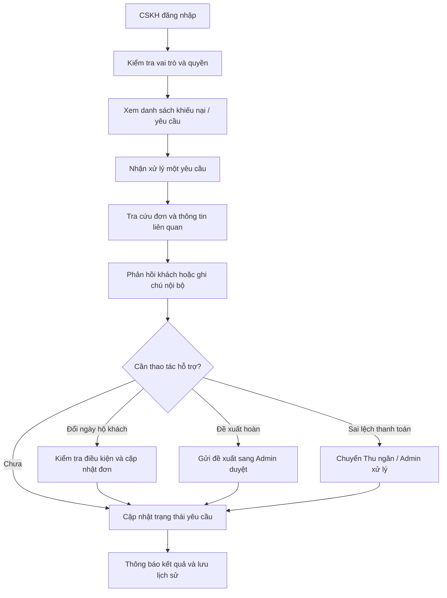

# Workflow 13 — Chăm sóc khách hàng

```mermaid
flowchart TD
 A[CSKH đăng nhập] --> B[Kiểm tra vai trò và quyền]
 B --> C[Xem danh sách khiếu nại / yêu cầu]
 C --> D[Nhận xử lý một yêu cầu]
 D --> E[Tra cứu đơn và thông tin liên quan]
 E --> F[Phản hồi khách hoặc ghi chú nội bộ]
 F --> G{Cần thao tác hỗ trợ?}
 G -->|Đổi ngày hộ khách| H[Kiểm tra điều kiện và cập nhật đơn]
 G -->|Đề xuất hoàn| I[Gửi đề xuất sang Admin duyệt]
 G -->|Sai lệch thanh toán| J[Chuyển Thu ngân / Admin xử lý]
 G -->|Chưa| K[Cập nhật trạng thái yêu cầu]
 H --> K
 I --> K
 J --> K
 K --> L[Thông báo kết quả và lưu lịch sử]
```

Thông tin nhạy cảm như CCCD được che; CSKH không tự duyệt hoặc chuyển tiền hoàn.
