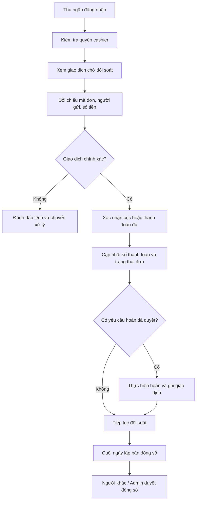

# Workflow 14 — Thu ngân

```mermaid
flowchart TD
 A[Thu ngân đăng nhập] --> B[Kiểm tra quyền cashier]
 B --> C[Xem giao dịch chờ đối soát]
 C --> D[Đối chiếu mã đơn, người gửi, số tiền]
 D --> E{Giao dịch chính xác?}
 E -->|Không| F[Đánh dấu lệch và chuyển xử lý]
 E -->|Có| G[Xác nhận cọc hoặc thanh toán đủ]
 G --> H[Cập nhật sổ thanh toán và trạng thái đơn]
 H --> I{Có yêu cầu hoàn đã duyệt?}
 I -->|Có| J[Thực hiện hoàn và ghi giao dịch]
 I -->|Không| K[Tiếp tục đối soát]
 J --> K
 K --> L[Cuối ngày lập bản đóng sổ]
 L --> M[Người khác / Admin duyệt đóng sổ]
```

Thu ngân xác nhận nhận tiền và thực hiện khoản hoàn đã được duyệt; người lập bản đóng sổ không tự duyệt bản đó.
