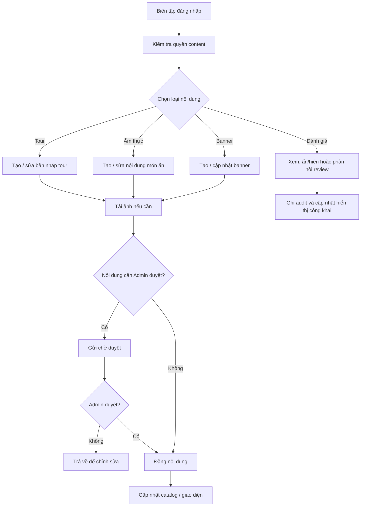

# Workflow 15 — Biên tập nội dung

```mermaid
flowchart TD
 A[Biên tập đăng nhập] --> B[Kiểm tra quyền content]
 B --> C{Chọn loại nội dung}
 C -->|Tour| D[Tạo / sửa bản nháp tour]
 C -->|Ẩm thực| E[Tạo / sửa nội dung món ăn]
 C -->|Banner| F[Tạo / cập nhật banner]
 C -->|Đánh giá| G[Xem, ẩn/hiện hoặc phản hồi review]
 D --> H[Tải ảnh nếu cần]
 E --> H
 F --> H
 H --> I{Nội dung cần Admin duyệt?}
 I -->|Có| J[Gửi chờ duyệt]
 J --> K{Admin duyệt?}
 K -->|Không| L[Trả về để chỉnh sửa]
 K -->|Có| M[Đăng nội dung]
 I -->|Không| M
 G --> N[Ghi audit và cập nhật hiển thị công khai]
 M --> O[Cập nhật catalog / giao diện]
```

Biên tập không sửa giá nhạy cảm, HDV hoặc sức chứa; quyền tải ảnh được kiểm tra tại API.
